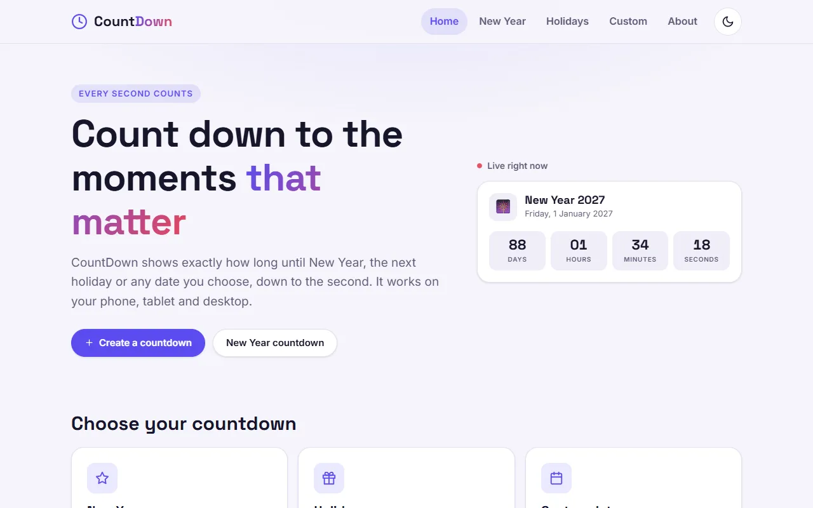
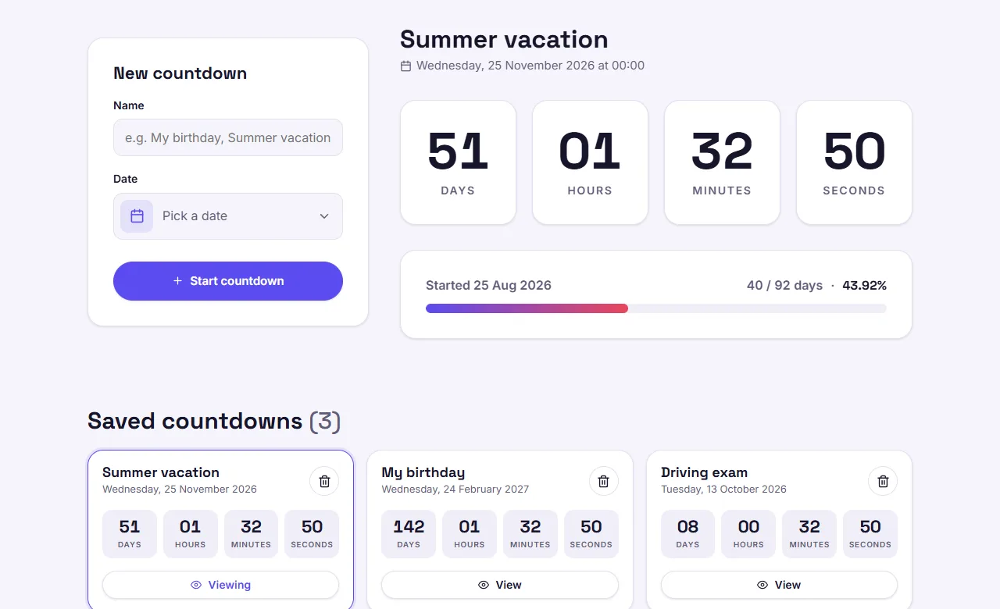
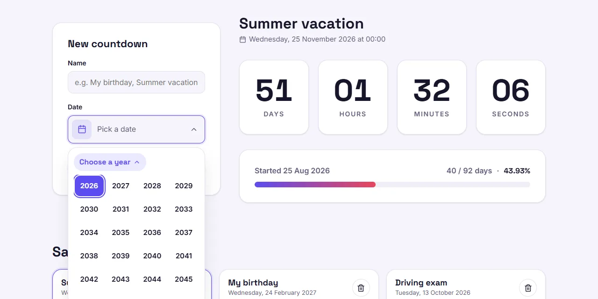
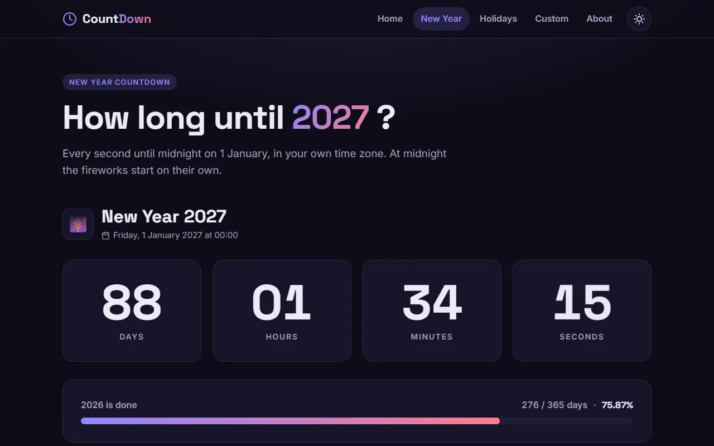
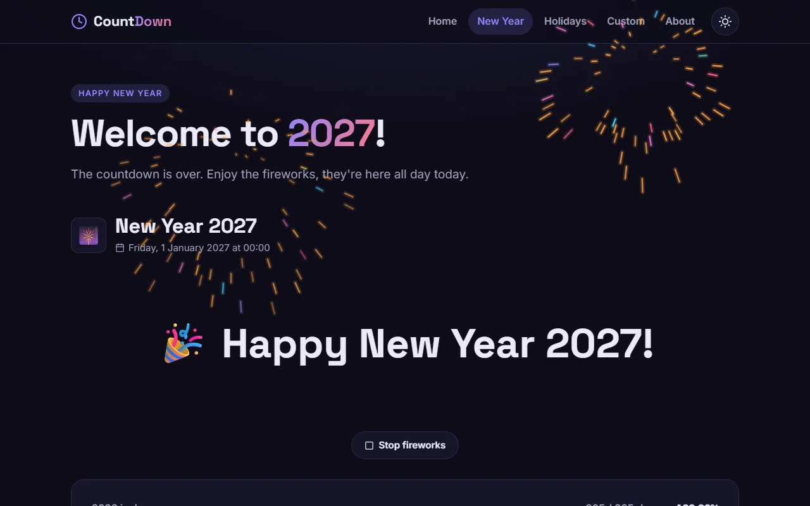
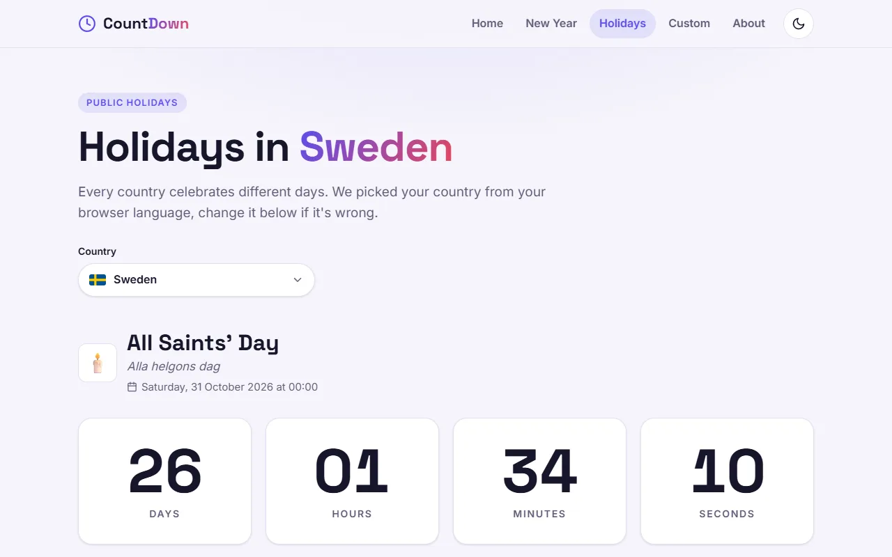
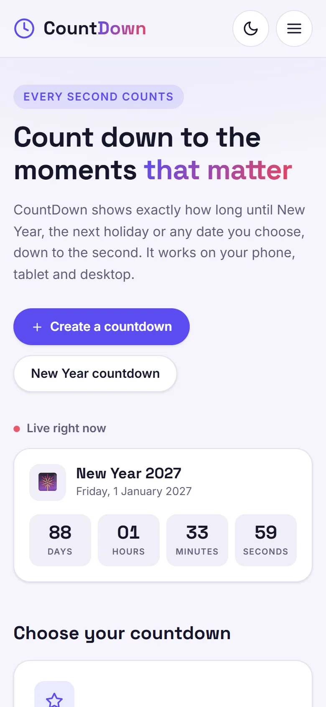
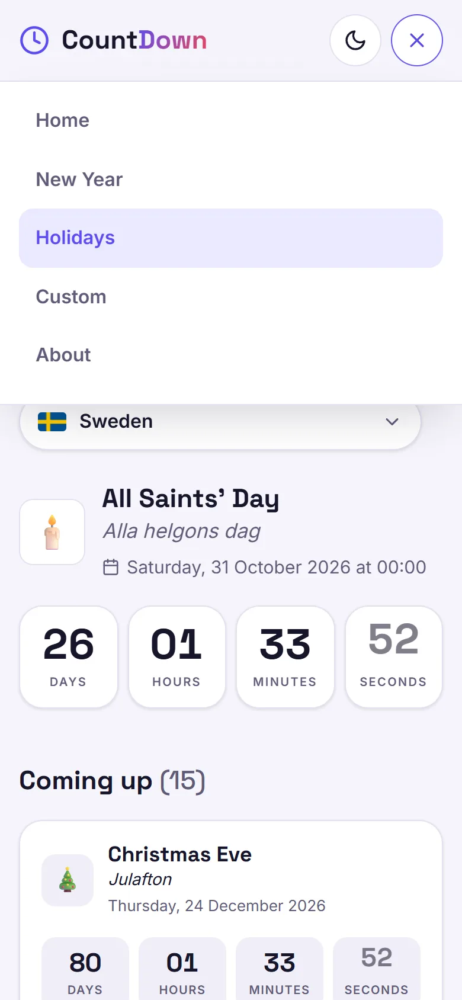
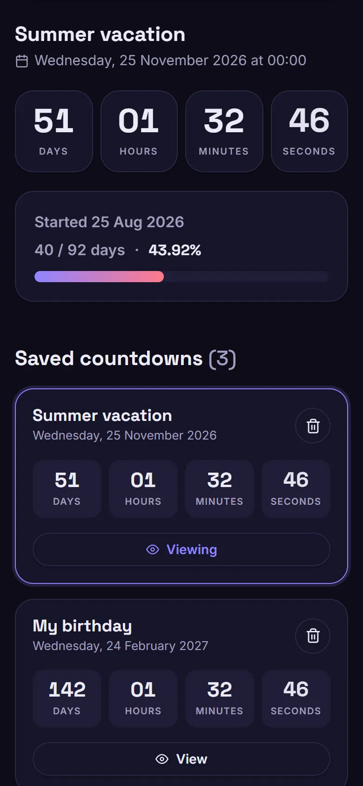

# CountDown ⏳

A React app that shows exactly how long is left until New Year, the next public holiday in your country, or any date you pick, down to the second.

**[Portfolio](https://nikolazovkoportfolio.netlify.app/#home)**



## Features

- **New Year countdown** with a progress bar for the current year (`276 / 365 days · 75.84%`). Leap years are handled.
- **Fireworks on New Year's Day**: at midnight on 1 January the page switches to "Welcome to 2027!" and starts a fireworks show. For the whole day anyone can start or stop it again. On 2 January it's gone and the countdown to the next year begins, even if the page was left open.
- **Public holidays for 100+ countries** from the [Nager.Date API](https://date.nager.at):
  - the country is guessed from the browser language (`sv` → Sweden, `hr` → Croatia) and can be changed from a dropdown
  - local names are shown next to the English ones, for example _Dan državnosti_
  - holidays that only apply in part of a country are marked _Regional_
- **Custom countdowns**: give it a name and pick a date. Countdowns are saved in `localStorage`, so they are still there after a refresh.
  - a progress bar shows how much time has passed since the countdown was added (`40 / 92 days · 43.92%`)
  - **View** shows any saved countdown in the big panel
  - deleting asks for confirmation first
- **Custom date picker**: click the month title to pick a year, then a month, then a day. A date 5 years away takes four clicks instead of sixty. Past dates are disabled.
- **Light and dark theme**. The system setting is used on the first visit, and your choice is remembered.
- **Responsive** from small phones (360px) to large screens. On mobile the navigation becomes a menu.
- **Accessible**: the menu, date picker and dialogs close on a click outside or <kbd>Esc</kbd>, the calendar works with the keyboard, and animations follow the system's _reduce motion_ setting.

## Screenshots

| Custom countdowns | Picking a year |
| --- | --- |
|  |  |

| New Year (dark theme) | Fireworks on 1 January |
| --- | --- |
|  |  |

| Public holidays |
| --- |
|  |

| Mobile | Mobile menu | Mobile, dark theme |
| --- | --- | --- |
|  |  |  |

## Tech stack

- [React 19](https://react.dev/) + [Vite](https://vite.dev/)
- [React Router 7](https://reactrouter.com/)
- [React Day Picker](https://daypicker.dev/) for the day grid, wrapped in custom year and month views
- [React Hot Toast](https://react-hot-toast.com/) for notifications
- [React Icons](https://react-icons.github.io/react-icons/) (Feather icons)
- [Nager.Date API](https://date.nager.at) for public holidays, [flagcdn.com](https://flagcdn.com/) for flags
- Plain CSS with custom properties for theming, container queries for the countdown numbers
- Fireworks drawn on a `<canvas>`, without a library

## Project structure

```
project/src/
├── components/   reusable UI, one folder per component (Name.jsx + Name.css)
├── hooks/        useNow, useCountdown, useLocalStorage, useCustomCountdowns,
│                 useHolidays, useAsync, useClickOutside, useTheme, useTitle
├── pages/        Home, NewYear, Holidays, CustomCountdown, About, Error
└── utils/        time helpers, holidays API, fireworks engine, constants and page text
```

All countdowns tick from one shared clock (`useNow`) that fires on every full second, so the numbers on a page always change together.

## Run locally

```bash
cd project
npm install
npm run dev
```

Other scripts: `npm run build` (production build into `project/dist`), `npm run preview` and `npm run lint`.

## Deploy

Deployed on [Netlify](https://www.netlify.com/). [`netlify.toml`](netlify.toml) tells Netlify that the app is in the `project` folder, so importing the repo needs no extra settings.

[`project/public/_redirects`](project/public/_redirects) sends every route to `index.html`, so refreshing `/custom` or `/holidays` doesn't give a 404.

## Author

**Nikola Zovko**, Stockholm, Sweden

[Portfolio](https://nikolazovkoportfolio.netlify.app/#home) · [GitHub](https://github.com/Nikolaz95) · [LinkedIn](https://www.linkedin.com/in/nikola-zovko-a50779247/) · [Email](mailto:nikolajoe95@gmail.com)
